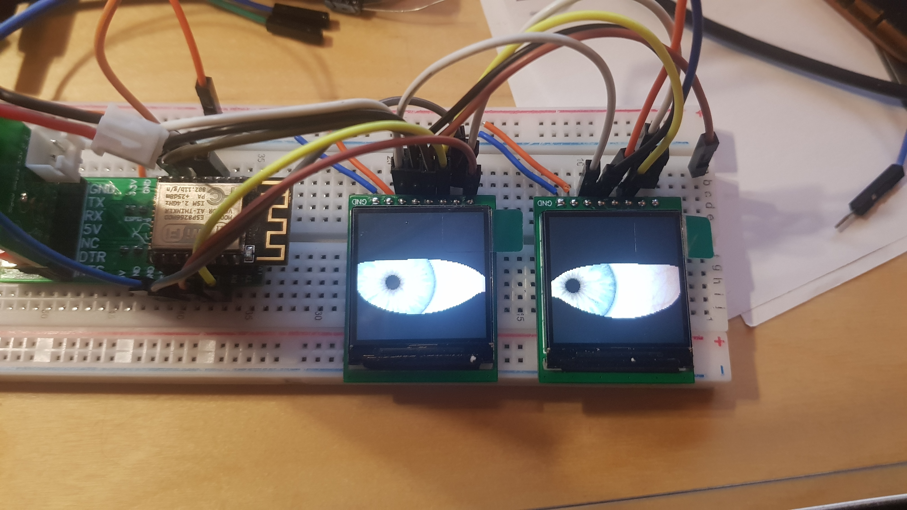
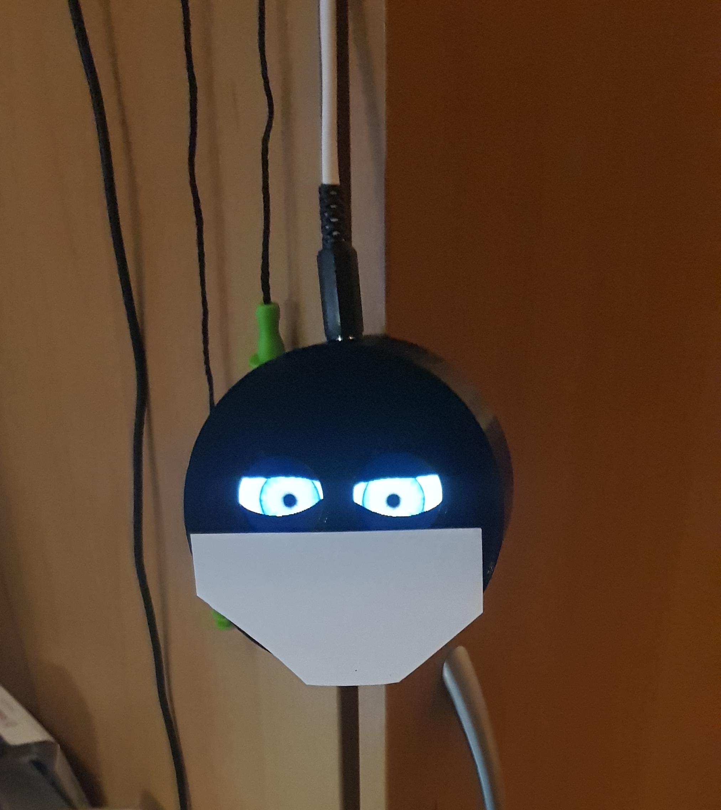

# NoriBigEye
 UncannyEyesExample of tft_eSPI library reworked
 

 This is an ESP8266 project. It uses all but 2 GPIO's (0 and A0).
 Results seem to improve if the ESP8266 is run at 160MHz.
 It is built to show off the nice little 240x240 ST7789 displays,
 and to scare the postman.
 
 Now works on 2 screens, which was not supported by the tft_eSPI
 unfortunately. Now, the Adafruit GFX lib is used.

 The left eye ( seen from the front) is mirrored by telling the left display
 to have the X coordinate start at the right side. 
   
   <pre>
   madctl = ST77XX_MADCTL_MX|ST77XX_MADCTL_RGB;    
   eye[0].tft.sendCommand( ST77XX_MADCTL,&madctl,1 ); 
   </pre>
   
 Also ported pixel doubling from https://learn.adafruit.com/animated-electronic-eyes/overview
 This gives a scarier effect, which is the point I think.
 
 The graphics files from that project have been converted to a format this (older) version
 of the uncanny eyes project understands, using tablegen_oldstyle.py in the convert directory. 
 For original graphics see the original code at https://github.com/adafruit/Uncanny_Eyes
 NB when redirecting the output to a file on Windows, double width characters are written, which causes
 gcc to choke, it finds null characters every other position.
 Workaround: load the generated .h file in Notepad++, choose encoding, convert to ascii.
 
 For fun I edited the Iris file of defaultEye and filled a lot of the colours with red.
 see redEye.h. Looks like a zombie. 
 
 Eyes are made to react on a proximity sensor which publishes it's status on mqtt.
 
 Wifi SSID and password, mqtt server, username and passwordare stored in a headerfile
 wificredentials.h, which should contain the following variables with your own info:

 ssid, password, mqttServer, mqttPort, mqttUser, mqttPassword and MQtopic names proxtopic and statustopic.

 Added OTA (over-the-air) update capability, so eyetypes can be changed fairly effortlessly.
 
 WARNING: Security was not taken into account for this design.
 
 In OpenSCAD designed and printed a pillbox to contain the eyes. It's not perfect and as I 
 use my own boards with particular sizes this is of limited use for others. But for reference,
 the OpenSCAD sources are in directory 3dbox.
 
 
 
